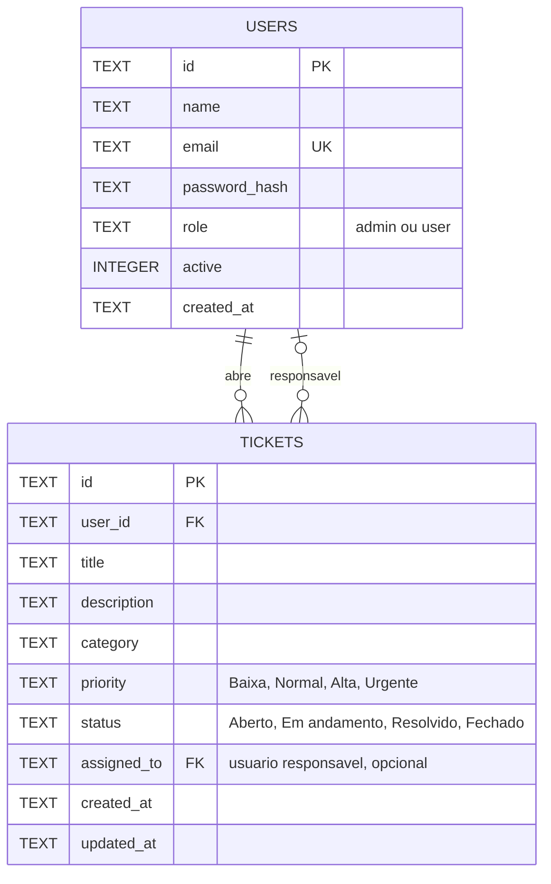

# Modelo de dados e regras de negócio

## Diagrama ER

Cada chamado pertence a exatamente um solicitante. Também pode ter um usuário responsável; uma conta pode ser responsável por vários chamados.

## Regras de negócio

1. O email é obrigatório e único, sem diferenciar maiúsculas de minúsculas.
2. O cadastro aberto cria somente contas com perfil `user`. A promoção para `admin` é feita por um administrador já autenticado.
3. Apenas usuários ativos podem entrar. A senha deve ter ao menos 8 caracteres e é armazenada com hash scrypt e salt individual.
4. Um usuário comum só lista e pesquisa os próprios chamados. Pode editar ou excluir os próprios chamados enquanto estiverem com status `Aberto`; não pode alterar status.
5. Um administrador pode pesquisar chamados por assunto, descrição, categoria, status ou nome do solicitante; editar e excluir qualquer chamado e mudar seu status.
6. Apenas administradores podem pesquisar, editar, desativar e excluir contas. A pesquisa de usuários considera nome e email.
7. Uma conta não pode excluir a si própria. O sistema deve manter pelo menos um administrador ativo: o último não pode ser desativado, rebaixado nem excluído.
8. A exclusão de uma conta remove também os chamados associados. A aplicação executa as duas exclusões na mesma transação para evitar dados órfãos.
9. Assuntos têm de 4 a 140 caracteres; descrições, de 10 a 5.000. Prioridades e status só aceitam os valores listados no esquema.
10. O status inicial é `Aberto`; prioridades possíveis são `Baixa`, `Normal`, `Alta` e `Urgente`.
11. Para mudar um chamado para `Em andamento`, o administrador precisa escolher uma conta ativa como responsável.
12. Ao voltar o chamado para `Aberto`, o responsável é removido. Se uma conta responsável for excluída, o chamado continua existindo sem responsável.

## DDL

O arquivo [`schema.sql`](schema.sql) contém as instruções DDL usadas para declarar as tabelas, chaves, restrições e índices no SQLite. Ele define a estrutura; o servidor continua responsável por criar a conta inicial e armazenar senhas com hash.
